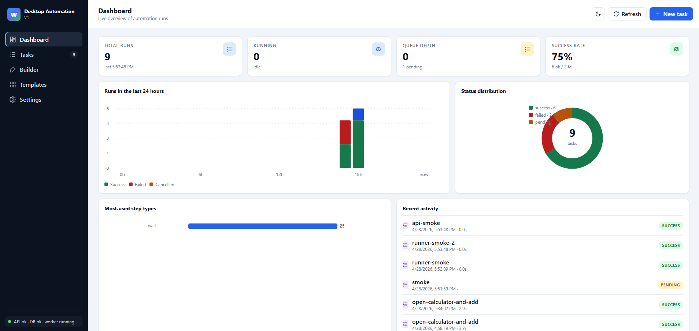
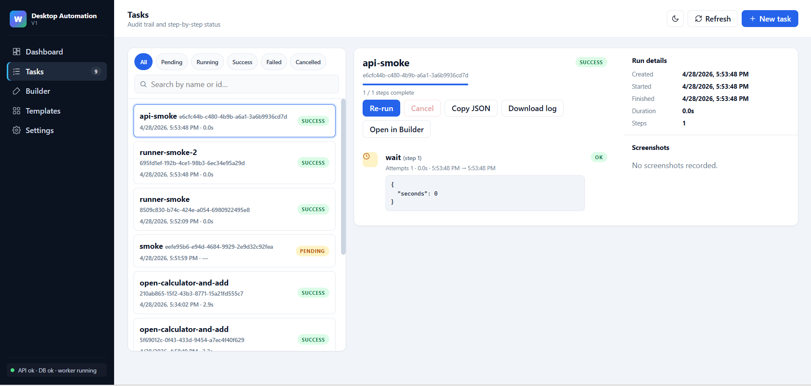
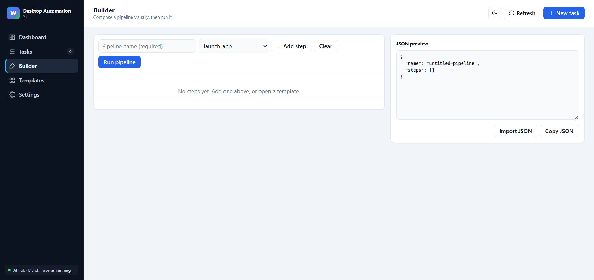
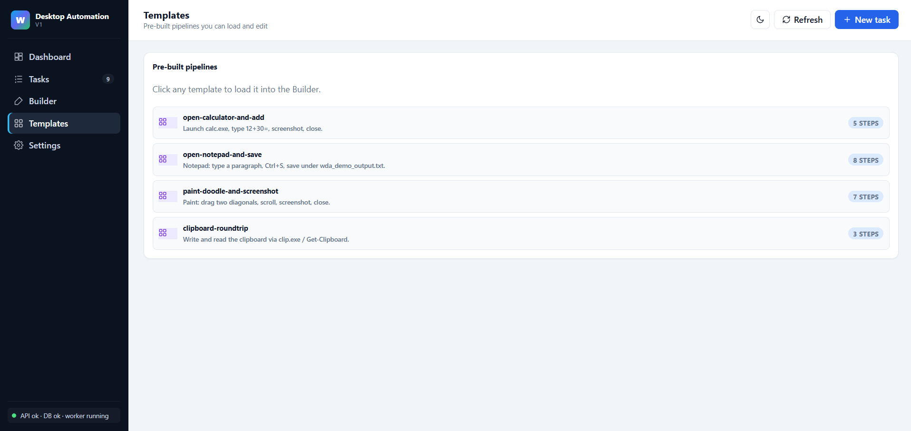
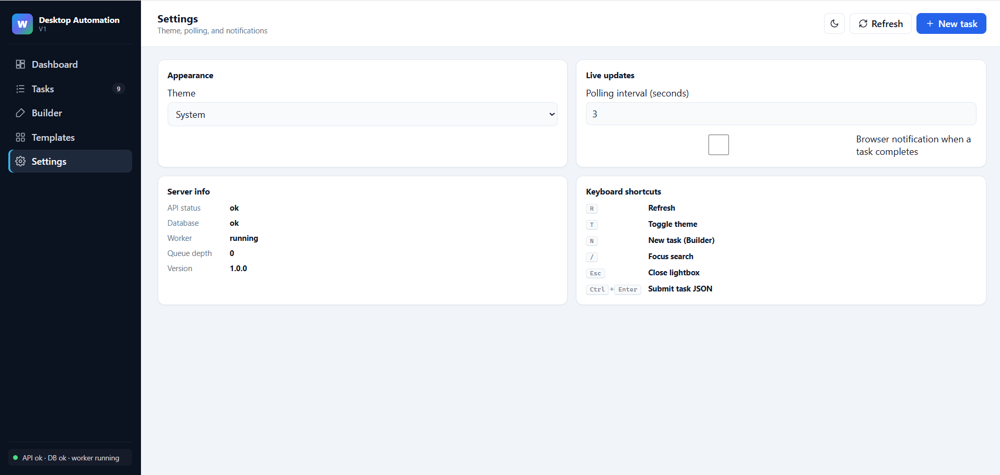

# Windows Desktop Automation Framework

A production-grade Python framework for automating Windows desktop workflows through JSON-driven pipelines, exposed over a FastAPI REST service with a single-consumer background worker, SQLite-backed audit logs, automatic screenshots on failure, and a Typer CLI client.

---

## Features

- **JSON pipelines** — express any workflow as a list of typed steps.
- **Pluggable step handlers** — `launch_app`, `close_app`, `click`, `move_mouse`, `type_text`, `hotkey`, `wait`, `screenshot`, `scroll`, `drag`, `key_press`, `write_clipboard`, `read_clipboard`. Add new handlers by subclassing `StepHandler` and registering it.
- **Per-step retry + timeout** — every step declares its own `retries`, `retry_delay`, `timeout_seconds`, and `on_failure` (`abort` | `continue`).
- **Screenshot on failure** — the runner captures the desktop on any step failure and stores the path in the audit row; screenshots are also browsable from the dashboard.
- **Async REST API** — FastAPI with `POST /run-task`, `GET /status/{task_id}`, `GET /tasks` (filter + search + pagination), `POST /cancel/{task_id}`, `GET /stats`, `GET /health`, `GET /screenshots/{file}`.
- **SQLite persistence** — every task and every step attempt is recorded.
- **Single-consumer worker** — `pyautogui` controls a single physical mouse and keyboard, so the queue is drained serially while the API stays fully async. The worker exposes `running_task_id` and `queue_depth` for live UI.
- **Built-in dashboard** at `/` — light/dark theme, status filters, name search, screenshot lightbox, re-run, cancel, copy/download task JSON, keyboard shortcuts.
- **Typer CLI** — `submit`, `status`, `list`, `watch`, `cancel`, `stats`, `health`, all going through the same API.

---

## Project layout

```
.
├── app/
│   ├── api/routes.py            # HTTP routes
│   ├── automation/
│   │   ├── steps.py             # StepHandler ABC + concrete handlers
│   │   ├── executor.py          # Per-step retry executor
│   │   ├── runner.py            # Pipeline orchestrator
│   │   └── screenshot.py        # Desktop capture utility
│   ├── core/
│   │   ├── config.py            # Pydantic settings
│   │   ├── logger.py            # Rotating file + console logger
│   │   └── exceptions.py        # Framework exceptions
│   ├── db/
│   │   ├── database.py          # SQLAlchemy engine, session_scope
│   │   └── models.py            # Task, StepLog ORM
│   ├── schemas/task.py          # Pydantic request/response models
│   ├── services/task_service.py # DB-facing business logic
│   ├── workers/background.py    # Single-consumer asyncio worker
│   └── main.py                  # FastAPI app + lifespan
├── cli/cli.py                   # Typer client
├── tasks/                       # Example task JSONs
├── tests/                       # pytest unit tests
├── data/                        # SQLite database (created at runtime)
├── logs/                        # Rotating logs
├── screenshots/                 # On-failure and step screenshots
├── run.py                       # uvicorn launcher
└── requirements.txt
```

---

## Setup

> Tested with Python 3.10+ on Windows 10/11.

```powershell
# 1. Create and activate a virtualenv
py -3.11 -m venv .venv
.\.venv\Scripts\Activate.ps1

# 2. Install dependencies
pip install -r requirements.txt

# 3. (optional) Configure via environment variables — all are prefixed WDA_
#    e.g. WDA_PORT=9000, WDA_DEFAULT_STEP_RETRIES=3, WDA_DATABASE_URL=...
```

The first run automatically creates `data/automation.db`, `logs/`, and `screenshots/`.

---

## Running

### Start the API server

```powershell
python run.py
# OR
uvicorn app.main:app --host 127.0.0.1 --port 8000
```

OpenAPI docs are at `http://127.0.0.1:8000/docs`.

### Submit a task via the CLI

```powershell
python -m cli.cli submit tasks\notepad_example.json
python -m cli.cli list
python -m cli.cli watch <task_id>
```

### Submit a task via HTTP

```powershell
curl.exe -X POST http://127.0.0.1:8000/run-task `
  -H "Content-Type: application/json" `
  --data "@tasks/notepad_example.json"
```

Then:

```powershell
curl.exe http://127.0.0.1:8000/status/<task_id>
```

---

## Pipeline schema

```jsonc
{
  "name": "human-readable-name",
  "steps": [
    {
      "type": "launch_app",            // required, see step types below
      "params": { "path": "notepad.exe", "wait_seconds": 1.5 },
      "retries": 1,                     // optional, defaults to WDA_DEFAULT_STEP_RETRIES
      "retry_delay": 1.0,               // optional, seconds
      "on_failure": "abort"             // 'abort' (default) | 'continue'
    }
  ]
}
```

### Step types

| Type | Required params | Optional params |
|---|---|---|
| `launch_app` | `path` | `args` (list or string), `wait_seconds` |
| `close_app` | `image_name` | `force` (bool, default `true`) |
| `click` | `x`,`y` **or** `image` | `button`, `clicks`, `confidence` |
| `move_mouse` | `x`,`y` | `duration` |
| `type_text` | `text` | `interval` |
| `hotkey` | `keys` (list, e.g. `["ctrl","s"]`) | — |
| `key_press` | `key` (string or list) | `presses`, `interval` |
| `wait` | — | `seconds` |
| `screenshot` | — | `label` |
| `scroll` | `clicks` (positive=up, negative=down) | `x`, `y` |
| `drag` | `from_x`, `from_y`, `to_x`, `to_y` | `duration`, `button` |
| `write_clipboard` | `text` | — |
| `read_clipboard` | — | — |

Every step also accepts the universal fields `retries`, `retry_delay`, `timeout_seconds`, and `on_failure` (`"abort"` \| `"continue"`).

---

## Adding a new step type

1. Subclass `StepHandler` in `app/automation/steps.py`.
2. Set `type_name` and implement `execute(params)`.
3. Add an instance to `_build_registry()`.

That's it — the JSON schema picks it up automatically.

---

## Testing

```powershell
pip install pytest
pytest -q
```

The included tests cover the executor's retry semantics with fake handlers — no real desktop is required.

---

## Dashboard

Open `http://127.0.0.1:8000/` once the server is running:

- **Stats row** — total, running, queued, success, failed, cancelled, plus success-rate and average duration.
- **Status filter chips** — All / Queued / Running / Success / Failed / Cancelled.
- **Search** — by task name or id.
- **Detail panel** — per-step audit, attempt counts, durations, parameters, errors.
- **Screenshots** — thumbnail grid; click any thumbnail for a lightbox.
- **Actions** — Re-run (resubmits the same step list), Cancel (queued tasks only), Copy JSON, Download log.
- **Theme** — light / dark, remembered in `localStorage`.
- **Keyboard shortcuts** — `R` refresh · `T` toggle theme · `Esc` close lightbox · `Ctrl+Enter` submit task JSON.

---

## REST API reference

| Method | Path | Purpose |
|---|---|---|
| POST | `/run-task` | Persist + enqueue a task. Returns `task_id`. |
| GET | `/tasks?status=&q=&limit=&offset=` | List tasks, filterable by status / search query. |
| GET | `/status/{task_id}` | Full task + step audit. |
| GET | `/logs/{task_id}` | Alias of `/status` emphasising the audit trail. |
| POST | `/cancel/{task_id}` | Cancel a queued task. |
| GET | `/stats` | Aggregate metrics for the dashboard. |
| GET | `/health` | API/DB/worker health probe. |
| GET | `/screenshots/{filename}` | Serves a captured screenshot file. |
| GET | `/` and `/dashboard` | The HTML dashboard. |

---

## Configuration reference

All settings are env-variable driven (prefix `WDA_`):

| Variable | Default | Purpose |
|---|---|---|
| `WDA_HOST` | `127.0.0.1` | API bind host |
| `WDA_PORT` | `8000` | API port |
| `WDA_API_BASE_URL` | `http://127.0.0.1:8000` | URL the CLI talks to |
| `WDA_DATABASE_URL` | `sqlite:///./data/automation.db` | SQLAlchemy URL |
| `WDA_DEFAULT_STEP_RETRIES` | `2` | Default retry count if step omits it |
| `WDA_DEFAULT_RETRY_DELAY_SEC` | `1.0` | Default backoff between retries |
| `WDA_PYAUTOGUI_PAUSE_SEC` | `0.1` | Global pause between pyautogui actions |
| `WDA_PYAUTOGUI_FAILSAFE` | `true` | Move mouse to a corner to abort |
| `WDA_WORKER_QUEUE_SIZE` | `128` | Max queued tasks |

---

## Troubleshooting

### `AttributeError: module 'cv2' has no attribute '__version__'` at startup

`pyautogui → pyscreeze` imports `cv2` and reads `cv2.__version__`. There is a
**squatter package on PyPI literally named `cv2`** that imports successfully
but has no `__version__`. If it gets installed (often as an accidental
dependency or by a careless `pip install cv2`), `pyscreeze` crashes at import.

Fix:

```powershell
pip uninstall -y cv2
```

That's it — with no `cv2` importable, `pyscreeze` falls back to Pillow, which
is all this framework needs. If you genuinely want OpenCV-backed image
matching (for `click` with `image` + `confidence`), install the real package:

```powershell
pip install opencv-python
```

**Never install the package literally named `cv2`.**

### `ConnectError: [WinError 10061] ... target machine actively refused it` from the CLI

The CLI is a client; it needs the API server running. Open one terminal for
the server and a second for the CLI:

```powershell
# Terminal 1
python run.py

# Terminal 2
python -m cli.cli submit tasks\notepad_example.json
```

### Pipeline runs but my keystrokes go to the wrong window

`pyautogui` types into whichever window has focus. Don't move the mouse or
click into another window while a pipeline is running. The framework's
failsafe is on by default — slamming the cursor into a screen corner aborts.

---

## Operational notes

- The worker runs **one pipeline at a time** by design. This is not a bug; it reflects that there is exactly one mouse and keyboard. If you genuinely need parallelism, run separate machines (or separate Windows sessions) and put a load balancer in front.
- The API returns `202 Accepted` immediately after enqueueing. Use `GET /status/{task_id}` (or `cli watch`) to follow progress.
- Screenshots on failure are stored under `screenshots/` with the timestamp and a `fail_<task>_<step>` label, and the path is recorded on the failing `step_logs` row.
- Logs rotate at 5 MB × 5 files in `logs/automation.log`.

---

## Dashboard Screenshots










